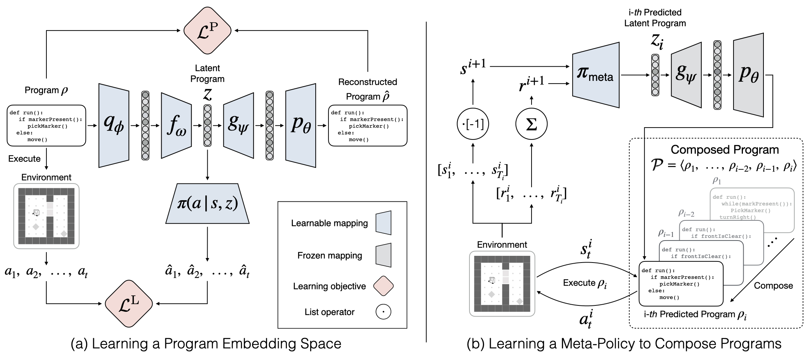

# Hierarchical Programmatic Reinforcement Learning via Learning to Compose Programs
This repository demonstrate the implementation code of [**Hierarchical Programmatic Reinforcement Learning via Learning to Compose Programs**](https://arxiv.org/abs/2301.12950), which is published in [**ICML 2023**](https://icml.cc/Conferences/2023). Please visit our [project page](https://nturobotlearninglab.github.io/hprl/) for more information.

We re-formulate solving a reinforcement learning task as synthesizing a task-solving program that can be executed to interact with the environment and maximize the return. We first learn a program embedding space that continuously parameterizes a diverse set of programs sampled from a program dataset. Then, we train a meta-policy, whose action space is the learned program embedding space, to produce a series of programs (i.e., predict a series of actions) to yield a composed task-solving program.

<p align="center">
	
</p>

The experimental results in the Karel domain show that our proposed framework outperforms baseline approaches. The ablation studies confirm the limitations of LEAPS and justify our design choices.


## Environments
### Karel Environments
- The implementation code can be found in [this directory](./karel_env)

## Getting Started

- [Python 3.6](https://www.python.org/downloads/release/python-360/)
- [PyTorch 1.4.0](https://pytorch.org/get-started/previous-versions/#v140)
- Install `virtualenv`, create a virtual environment, activate it and install the requirements in [`requirements.txt`](requirements.txt).

```
pip3 install --upgrade virtualenv
virtualenv hprl
source hprl/bin/activate
pip3 install -r requirements.txt
```

## Usage

### LEAPS Training

### Stage 1: Learning Program Embeddings

- Download dataset from [here](https://u.pcloud.link/publink/show?code=XZ2NVIVZAqHlzGwTP7XaaLezvVIwP8mJnpYk)

- Unzip the file 

```bash
bash run_vae_option_L30.sh
```

### Stage 2: Meta-Policy Training
```bash
bash run_meta_policy_new_vae_ppo_64dim.sh
```


## Cite the paper
```
@inproceedings{liu2023hierarchical, 
  title={Hierarchical Programmatic Reinforcement Learning via Learning to Compose Programs}, 
  author={Guan-Ting Liu and En-Pei Hu and Pu-Jen Cheng and Hung-Yi Lee and Shao-Hua Sun}, 
  booktitle = {International Conference on Machine Learning}, 
  year={2023} 
}
```

## Authors
[Guan-Ting Liu](https://dannyliu15.github.io/), [En-Pei Hu](https://guapaqaq.github.io/), [Pu-Jen Cheng]("https://www.csie.ntu.edu.tw/~pjcheng/"), [Hung-Yi Lee]("https://speech.ee.ntu.edu.tw/~hylee/index.php"), [Shao-Hua Sun](https://shaohua0116.github.io/)
