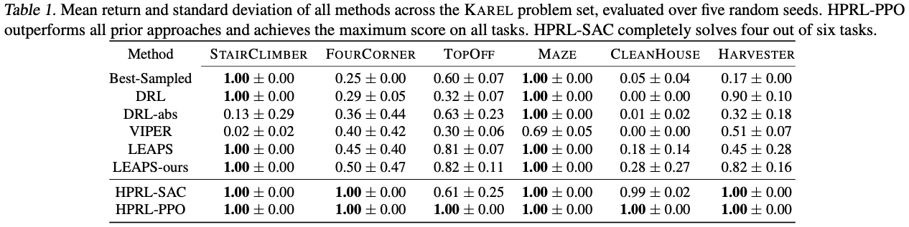
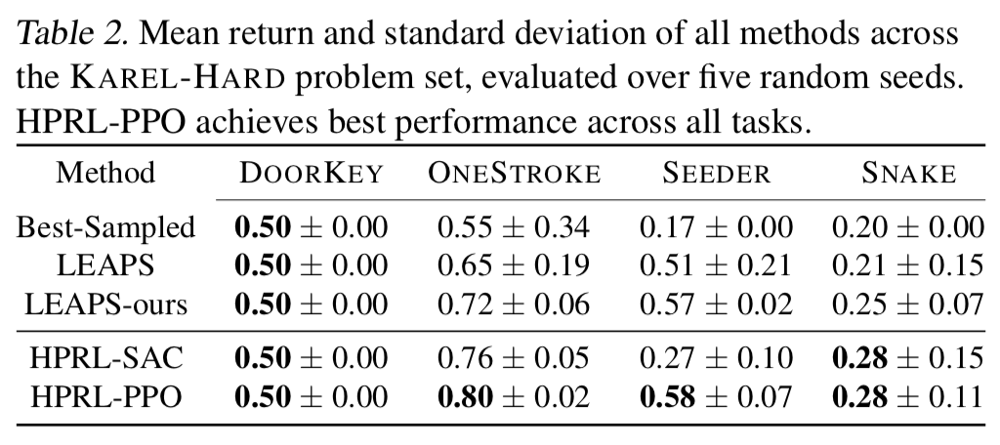
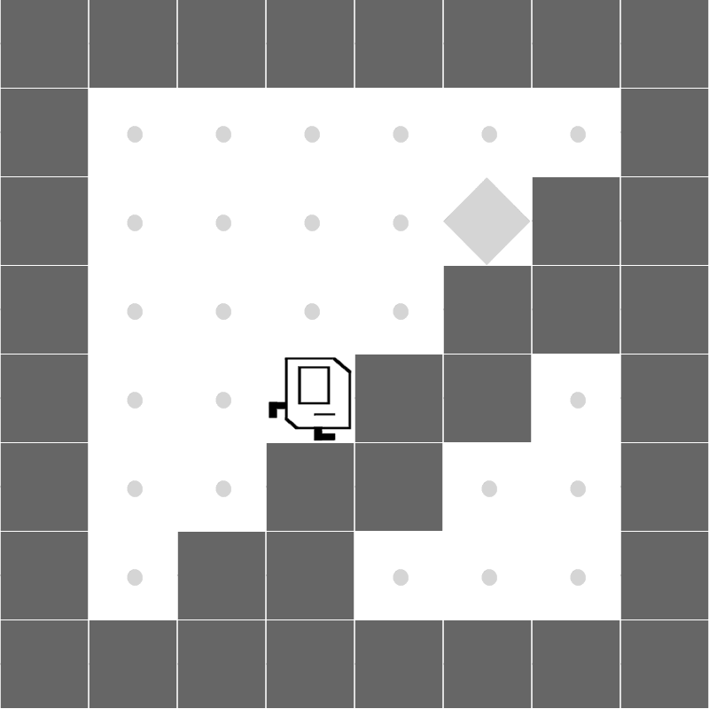
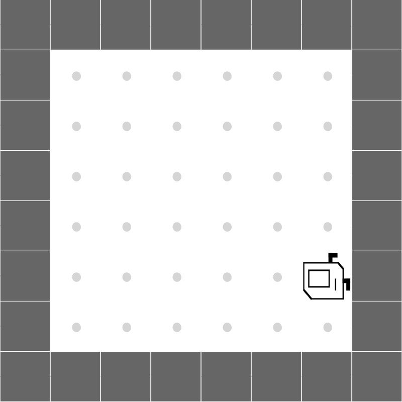
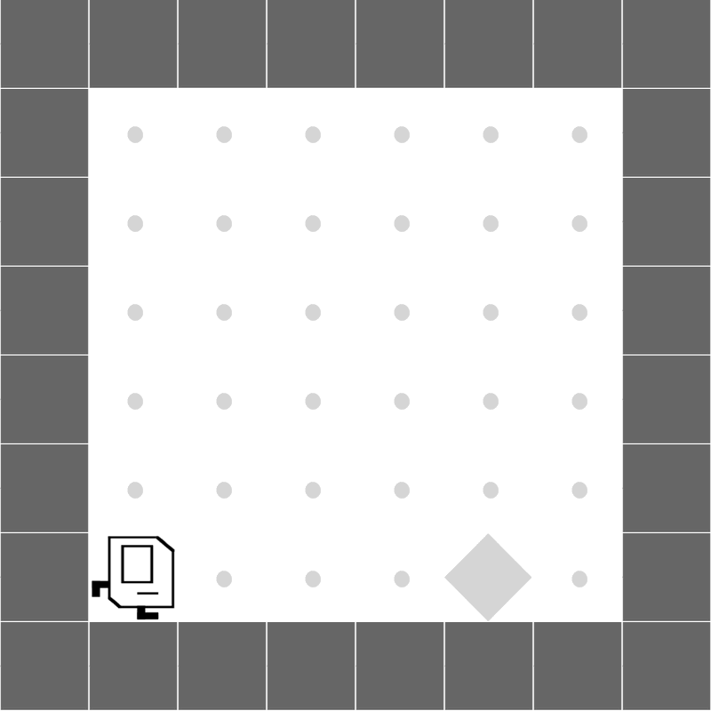
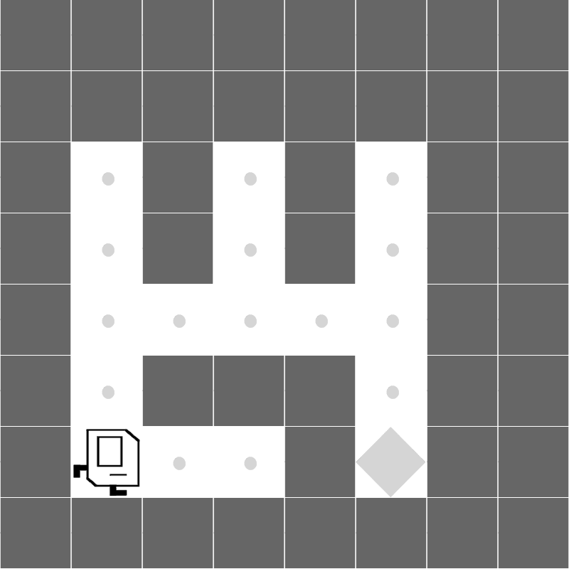
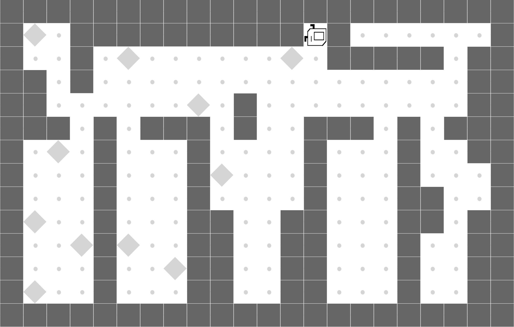
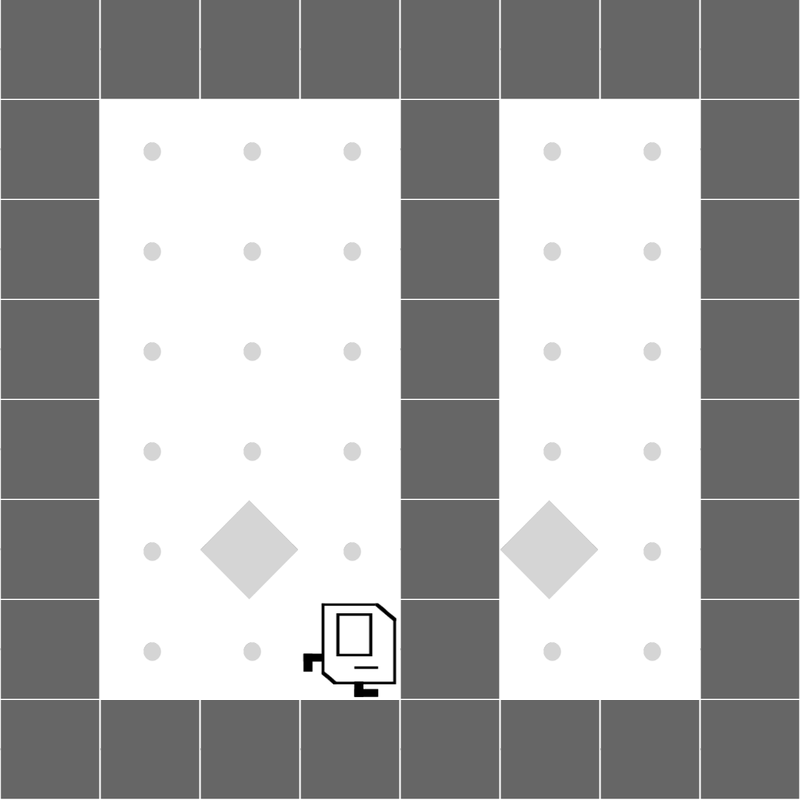
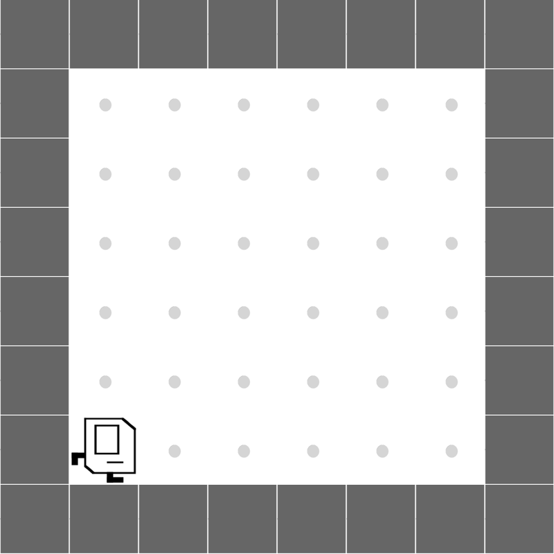
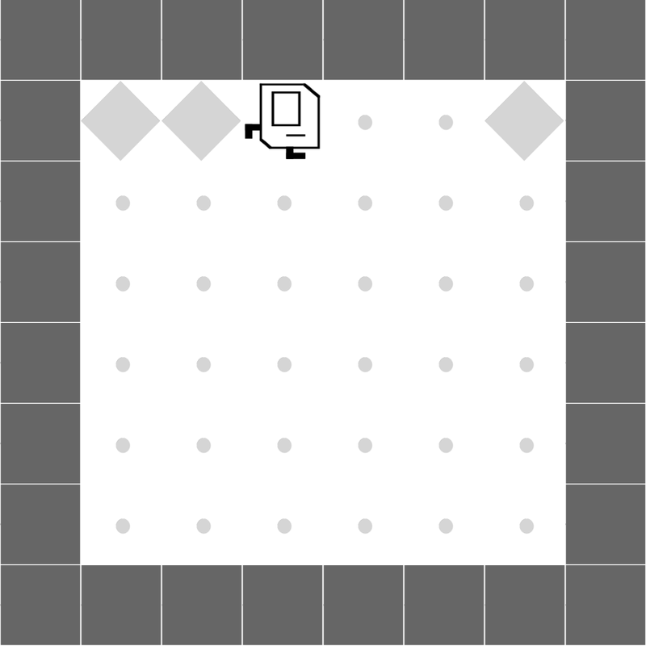

---

## Abstract

Aiming to produce reinforcement learning (RL) policies that are human-interpretable and can generalize better to novel scenarios, <a href="https://arxiv.org/abs/2108.13643">Trivedi et al. (2021)</a> present a method (LEAPS) that first learns a program embedding space to continuously parameterize diverse programs from a pre-generated program dataset, and then searches for a task-solving program in the learned program embedding space when given a task. Despite the encouraging results, the program policies that LEAPS can produce are limited by the distribution of the program dataset. Furthermore, during searching, LEAPS evaluates each candidate program solely based on its return, failing to precisely reward correct parts of programs and penalize incorrect parts. To address these issues, we propose to learn a meta-policy that composes a series of programs sampled from the learned program embedding space. By learning to compose programs, our proposed hierarchical programmatic reinforcement learning (HPRL) framework can produce program policies that describe out-of-distributionally complex behaviors and directly assign credits to programs that induce desired behaviors. The experimental results in the Karel domain show that our proposed framework outperforms baselines. The ablation studies confirm the limitations of LEAPS and justify our design choices.

----

## Framework Overview 


**(a) Learning a Program Embedding Space**: A continuously parameterized latent program space can be learned using the program encoder q<sub>ϕ</sub>, decoder p<sub>θ</sub>, and a neural executor policy π by optimizing the two reconstruction objectives: L<sub>P</sub> and L<sub>L</sub>. To reduce the dimensionality of the program embedding space for facilitate task learning, we employ a compression encoder f<sub>ω</sub> anda compression decoder g<sub>ψ</sub>.
**(b) Learning a Meta-Policy to Compose Programs**: Given a task described by an MDP, we propose to train a meta-policy π<sub>meta</sub> to compose a sequence of programs, and yield a task-solving program. Specifically, at each macro time step i, the meta-policy π<sub>meta</sub> predicts a latent program embedding z<sub>i</sub>, which can be decoded to the corresponding program ρ<sub>i</sub> = p<sub>θ</sub>(g<sub>ψ</sub>(z<sub>i</sub>)). We then execute the program ρ<sub>i</sub> in the environment, which returns the cumulative reward r<sup>i+1</sup> and the next state s<sup>i+1</sup> to the meta policy. Then, the meta-policy can synthesize next program ρ<sub>i+1</sub> based on s<sup>i+1</sup>. Upon termination, the predicted task-solving program is composed by a series of synthesized programs P = \< ρ<sub>1</sub>, ρ<sub>2</sub>, ... ρ<sub>|H|-1</sub>, ρ<sub>|H|</sub> \>.

----

## Environments & Tasks

----

## Quantitative Results







----


## Qualitative Results


----

## Additional Experiments Results

### KAREL problem set
|  |  |  |
|:---:|:---:|:---:|
|  |  |  |

### KAREL-HARD problem set
|  |  |
|:---:|:---:|
|  |  |

----

## Citation
```
@inproceedings{liu2023hierarchical, 
  title={Hierarchical Programmatic Reinforcement Learning via Learning to Compose Programs}, 
  author={Guan-Ting Liu and En-Pei Hu and Pu-Jen Cheng and Hung-Yi Lee and Shao-Hua Sun}, 
  booktitle = {International Conference on Machine Learning}, 
  year={2023} 
}
```
<br>
