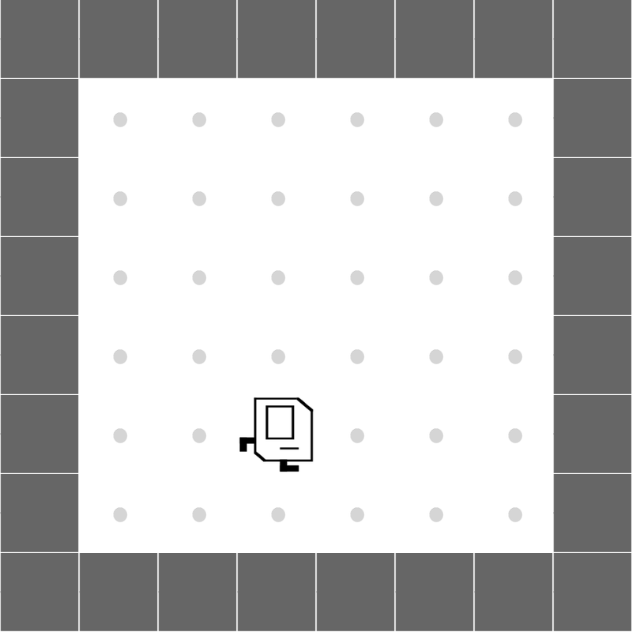
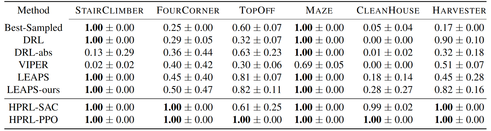
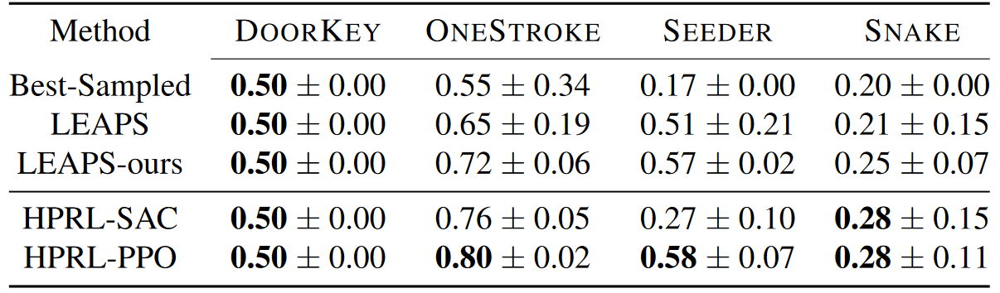
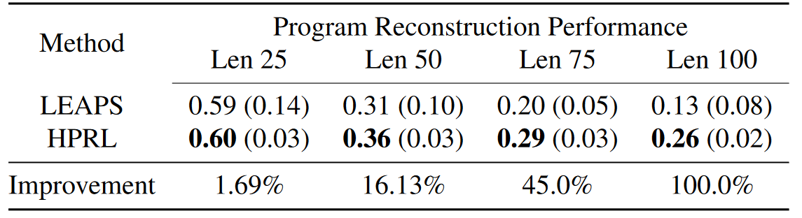
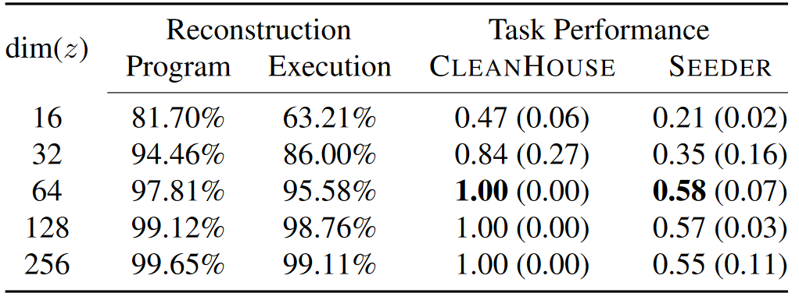
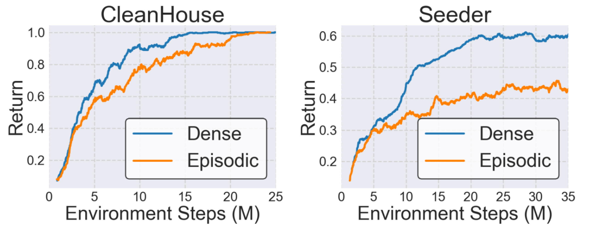

---

## Abstract

Aiming to produce reinforcement learning (RL) policies that are human-interpretable and can generalize better to novel scenarios, <a href="https://arxiv.org/abs/2108.13643">Trivedi et al. (2021)</a> present a method (LEAPS) that first learns a program embedding space to continuously parameterize diverse programs from a pre-generated program dataset, and then searches for a task-solving program in the learned program embedding space when given a task. Despite the encouraging results, the program policies that LEAPS can produce are limited by the distribution of the program dataset. Furthermore, during searching, LEAPS evaluates each candidate program solely based on its return, failing to precisely reward correct parts of programs and penalize incorrect parts. To address these issues, we propose to learn a meta-policy that composes a series of programs sampled from the learned program embedding space. By learning to compose programs, our proposed hierarchical programmatic reinforcement learning (HPRL) framework can produce program policies that describe out-of-distributionally complex behaviors and directly assign credits to programs that induce desired behaviors. The experimental results in the Karel domain show that our proposed framework outperforms baselines. The ablation studies confirm the limitations of LEAPS and justify our design choices.

----

## Framework Overview 


**(a) Learning a Program Embedding Space**: A continuously parameterized latent program space can be learned using the program encoder q<sub>ϕ</sub>, decoder p<sub>θ</sub>, and a neural executor policy π by optimizing the two reconstruction objectives: L<sub>P</sub> and L<sub>L</sub>. To reduce the dimensionality of the program embedding space to facilitate task learning, we employ a compression encoder f<sub>ω</sub> and a compression decoder g<sub>ψ</sub>.
**(b) Learning a Meta-Policy to Compose Programs**: Given a task described by an MDP, we propose to train a meta-policy π<sub>meta</sub> to compose a sequence of programs and yield a task-solving program. Specifically, at each macro time step i, the meta-policy π<sub>meta</sub> predicts a latent program embedding z<sub>i</sub>, which can be decoded to the corresponding program ρ<sub>i</sub> = p<sub>θ</sub>(g<sub>ψ</sub>(z<sub>i</sub>)). We then execute the program ρ<sub>i</sub> in the environment, which returns the cumulative reward r<sup>i+1</sup> and the next state s<sup>i+1</sup> to the meta policy. Then, the meta-policy can synthesize the next program ρ<sub>i+1</sub> based on s<sup>i+1</sup>. Upon termination, the predicted task-solving program is composed of a series of synthesized programs P = \< ρ<sub>1</sub>, ρ<sub>2</sub>, ... ρ<sub>|H|-1</sub>, ρ<sub>|H|</sub> \>.

----

## Environments & Tasks

### KAREL problem set

<table>
<tbody>
  <tr style="border-bottom: none;">
    <td style="text-align: center">
        
	<p style="text-align: center;padding-top: 10px">StairClimber</p>
    </td>
    <td style="text-align: center">
        
	<p style="text-align: center;padding-top: 10px">FourCorner</p>
    </td>
    <td style="text-align: center">
        
	<p style="text-align: center;padding-top: 10px">TopOff</p>
    </td>
  </tr>
</tbody>
</table>


<table>
<tbody>
  <tr style="border-bottom: none; padding:5px">
    <td style="text-align: center">
        
	<p style="text-align: center;padding-top: 10px">Maze</p>
    </td>
    <td style="text-align: center;width:45%">
        
	<p style="text-align: center;padding-top: 10px">CleanHouse</p>
    </td>
    <td style="text-align: center">
        
	<p style="text-align: center;padding-top: 10px">Harvester</p>
    </td>
  </tr>
</tbody>
</table>


### KAREL-HARD problem set
<table>
<tbody>
  <tr style="border-bottom: none;">
    <td style="text-align: center">
        
	<p style="text-align: center;padding-top: 10px">DoorKey</p>
    </td>
    <td style="text-align: center">
        
	<p style="text-align: center;padding-top: 10px">OneStroke</p>
    </td>
  </tr>
</tbody>
</table>


<table>
<tbody>
  <tr style="border-bottom: none;">
    <td style="text-align: center">
        
	<p style="text-align: center;padding-top: 10px">Seeder</p>
    </td>
    <td style="text-align: center">
        
	<p style="text-align: center;padding-top: 10px">Snake</p>
    </td>
  </tr>
</tbody>
</table>


----

## Quantitative Results

**Overall Karel Performance**: HPRL-PPO outperforms all other approaches on all tasks. Furthermore, HPRL-PPO can completely solve all the tasks in the KAREL problem set. The Best-sampled results justify the quality of the learned latent space as tasks like *StairClimber* and *Maze* can be entirely solved by one (or some) of 1000 randomly sampled programs. However, all 1000 randomly sampled programs fail on tasks that require long-term planning and exploration (e.g., *FourCorner*, *CleanHouse*, and *Harvester*), showing the limit of the simple search-based method. 

<span></span> 


**Overall Karel-Hard Performance**: HPRL-PPO outperforms other methods on *OneStroke* and *Seeder*, while all approaches perform similarly on *DoorKey*. The complexity of *OneStroke*, *Seeder*, and *Snake* makes it difficult for Best-sampled and LEAPS to find sufficiently long and complex programmatic policies that may not even exist in the learned program embedding space. In contrast, HPRL-PPO addresses this by composing a series of programs to increase the expressiveness and perplexity of the synthesized program. 


----

## Synthesized Programs

| Task | LEAPS || HPRL ||
|---|---|-|---|-|
|StairClimber| <pre style="font-size:11px;font-family:Consolas;overflow:auto;width:200%">DEF run m( <br>    WHILE c( noMarkersPresent c) w( <br>        turnRight <br>        move <br>        w) <br>    WHILE c( rightIsClear c) w( <br>        turnLeft <br>        w) <br>    m)</pre> || <pre style="font-size:11px;font-family:Consolas;overflow:auto;width:200%">DEF run m( <br>    WHILE c( noMarkersPresent c) w( <br>            turnRight <br>            move <br>            turnRight <br>            move <br>        w) <br>    m)</pre> ||
| TopOff | <pre style="font-size:11px;font-family:Consolas;overflow:auto;width:200%">DEF run m( <br>    WHILE c( noMarkersPresent c) w( <br>        move <br>        w) <br>    putMarker <br>    move <br>    WHILE c( not c( markersPresent c) c) w( <br>        move <br>        w)<br>    putMarker <br>    move <br>    WHILE c( not c( markersPresent c) c) w( <br>        move <br>        w) <br>    putMarker <br>    move <br>    turnRight <br>    turnRight <br>    turnRight <br>    turnRight <br>    turnRight <br>    turnRight<br>    turnRight <br>    turnRight <br>    m) || <pre style="font-size:11px;font-family:Consolas;overflow:auto;width:200%">DEF run m( <br>    REPEAT R=5 r( <br>        move <br>        WHILE c( noMarkersPresent c) w( <br>            move <br>            w) <br>        putMarker <br>        r)<br>    m)</pre> ||
| Snake | <pre style="font-size:11px;font-family:Consolas;overflow:auto;width:200%">DEF run m( <br>    turnRight <br>    turnLeft <br>    pickMarker <br>    move <br>    move <br>    move <br>    WHILE c( rightIsClear c) w( <br>        turnLeft <br>        move <br>        move <br>        w) <br>    turnLeft <br>    turnLeft <br>    turnLeft <br>    turnLeft <br>    m)</pre> || <pre style="font-size:11px;font-family:Consolas;overflow:auto;width:200%">DEF run m( <br>    move <br>    WHILE c( noMarkersPresent c) w( <br>        move <br>        move <br>        turnLeft <br>        w) <br>    move <br>    turnLeft <br>    m)<br>DEF run m( <br>    move <br>    WHILE c( noMarkersPresent c) w( <br>        move <br>        move <br>        turnLeft <br>        w) <br>    m)<br>DEF run m( <br>    move <br>    WHILE c( noMarkersPresent c) w( <br>        move <br>        move <br>        turnLeft <br>        w) <br>    move <br>    turnLeft <br>    m)</pre> ||


----

## Additional Experiments Results



**Learning to Synthesize Out-of-Distributional Programs**: We create a set of target programs of lengths 25, 50, 75, and 100, each consisting of primitive actions (e.g., move, turnRight). Then, we ask LEAPS and HPRL to fit each target program based on how well the program produced by the two methods can reconstruct the behaviors of the target program. The reconstruction performance is calculated as one minus the normalized Levenshtein Distance between the state sequences from the execution trace of the target program and from the execution trace of the synthesized program. HPRL consistently outperforms LEAPS with varying target program lengths, and the gap between the two methods grows more significant when the target program becomes longer. 

<span></span> 



**The Dimensionality of the Program Embedding Space**: Learning a higher-dimensional program embedding space can lead to better optimization in the program reconstruction loss (L<sub>P</sub>) and the latent behavior reconstruction loss (L<sub>L</sub>). Yet, learning a meta-policy in a higher-dimensional action space can be unstable and inefficient. To investigate this trade-off and verify our contribution of employing the compression encoder f<sub>ω</sub> and compression decoder g<sub>ψ</sub> , we experiment with various dimensions of program embedding space. The result indicates that a 64-dimensional program embedding space achieves satisfactory reconstruction accuracy and performs the best on the tasks.

<span></span> 



**Learning from Episodic Reward**: We design our framework to synthesize a sequence of programs, allowing for accurately rewarding correct programs and penalizing wrong programs (i.e., better credit assignment) with dense rewards. In this experiment, instead of receiving a reward for executing each program (i.e., dense) in the environment, we modify *CleanHouse* and *Seeder* so that they only return cumulative rewards after all |H| programs have been executed (i.e., episodic). The learning performance shows that learning from dense rewards yields better sample efficiency compared to learning from episodic rewards. This performance gain is made possible by the hierarchical design of HPRL, which can better deal with credit assignment. 


----

## Citation
```
@inproceedings{liu2023hierarchical, 
  title={Hierarchical Programmatic Reinforcement Learning via Learning to Compose Programs}, 
  author={Guan-Ting Liu and En-Pei Hu and Pu-Jen Cheng and Hung-Yi Lee and Shao-Hua Sun}, 
  booktitle = {International Conference on Machine Learning}, 
  year={2023} 
}
```
<br>
